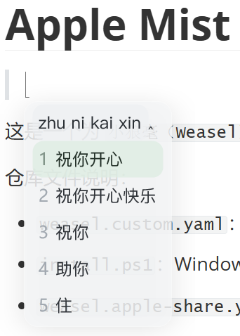
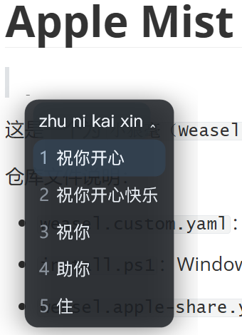
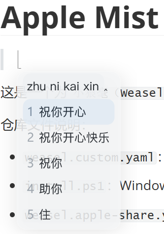
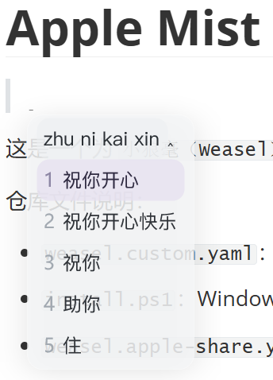
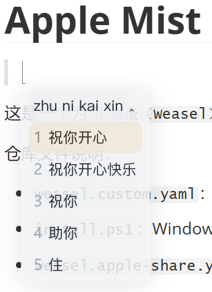
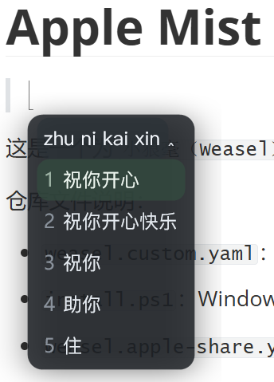
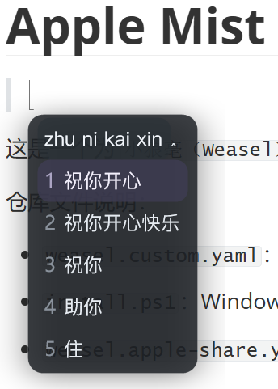
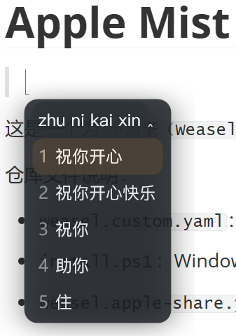

# Apple Mist Rime Theme ✨


这是一个为 `小狼毫（Weasel）` 制作的 Rime 主题，已经整理成可以直接使用的发布结构。

它的核心视觉方向，不是普通的纯色扁平风，而是更接近 Apple 风格的「液态玻璃」效果 🫧

- 半透明雾面背景
- 柔和高光边框
- 轻量阴影悬浮感
- 大圆角与更松弛的留白

整体观感会更轻、更透，也更像一块漂浮在桌面上的玻璃输入窗。

## 预览一眼看懂 👀

Apple Mist 想做的不是“换个配色”，而是让候选窗从传统输入法面板的厚重感里跳出来，变成一块有空气感、带边缘反光、轻轻浮在桌面上的玻璃层。

如果你喜欢下面这些关键词，这个主题大概率会很对胃口：

- 轻透
- 柔和
- 克制
- 细腻
- 有一点点 Apple 式的精致感

## 效果总览 🖼️

下面这两套，是最能体现 Apple Mist 液态玻璃气质的推荐配色：

**推荐浅色：`apple-mist-light-sage`**



**推荐深色：`apple-mist-dark-sky`**



如果你第一次使用，建议先从这两套开始体验。它们在通透感、柔和度和日常耐看程度之间比较平衡。 ✨

仓库文件说明：

- `weasel.custom.yaml`：可直接安装到 Rime 配置目录的主题文件
- `install.ps1`：Windows 一键安装脚本
- `install.bat`：可直接双击的安装入口
- `apple-mist.weasel-source.yaml`：主题源文件，方便二次修改或分享

## 主题亮点 🌫️

- 提供 8 套配色方案
- 同时支持浅色和深色模式
- 已预设字体、圆角、阴影、间距等界面样式
- 强调液态玻璃质感，弱化传统输入法面板的生硬边框感

## 液态玻璃效果说明 🪟

这个主题的重点不只是“换个颜色”，而是尽量把候选窗做出类似液态玻璃的层次感：

- 使用 `rgba` 配色格式，保留背景通透感
- 通过低不透明度背景色，让面板更轻盈
- 通过浅色边框和柔和阴影，模拟玻璃边缘的反光与悬浮
- 通过高亮候选项的半透明底色，营造内容浮在玻璃上的感觉
- 通过较大的圆角和更细的边框，让整体更接近现代系统 UI 气质

如果你喜欢那种「干净、克制、带一点空气感」的视觉风格，这个主题会比较贴近这种方向。 🍃

## 设计理念 ✍️

这个主题的灵感，来自 Apple 系界面里常见的那种轻雾感、玻璃感和层级感。

我想保留输入法候选窗“高可读、低干扰”的本质，同时让它在视觉上更柔软一些：

- 不追求花哨，而是追求安静、通透、耐看
- 不让高亮项过分跳脱，而是让它像玻璃表面上的一层柔和反射
- 不做厚重描边，而是用淡边框和阴影去建立存在感

所以它看起来不会很“炸”，但会更适合长期使用。时间久了，你会更容易注意到它的舒服，而不是它的喧闹。 ☁️

## 适用环境 💻

本主题适用于 Windows 下的 `小狼毫（Weasel）`。

## 一键安装 🚀

如果你希望尽量少操作，直接双击运行仓库中的 `install.bat` 即可。

你也可以手动运行 `install.ps1`。

它会做下面几件事：

1. 自动定位你的 Rime 用户目录 `%APPDATA%\\Rime`
2. 如果已存在 `weasel.custom.yaml`，先自动备份
3. 将仓库中的 `weasel.custom.yaml` 复制到 Rime 目录

运行完成后，你只需要：

1. 右键任务栏中的小狼毫图标
2. 选择“重新部署”

## 手动安装 🛠️

如果你不想运行脚本，也可以手动安装：

1. 打开 `%APPDATA%\\Rime`
2. 将本仓库中的 `weasel.custom.yaml` 复制到该目录
3. 如果提示覆盖，先确认你是否需要保留原有自定义配置
4. 右键小狼毫托盘图标，选择“重新部署”

## 文件结构 📁

```text
.
├─ img/
│  ├─ preview-light-sage.png
│  ├─ preview-light-sky.png
│  ├─ preview-light-lilac.png
│  ├─ preview-light-sand.png
│  ├─ preview-dark-sage.png
│  ├─ preview-dark-sky.png
│  ├─ preview-dark-lilac.png
│  └─ preview-dark-sand.png
├─ install.bat
├─ install.ps1
├─ weasel.custom.yaml
└─ apple-mist.weasel-source.yaml
```

## 重要说明 ⚠️

`install.ps1` 和手动复制 `weasel.custom.yaml` 的方式，都会以这个主题文件作为你的 `weasel.custom.yaml`。

这意味着：

- 对普通用户来说，这是最省事、最接近一键使用的方式
- 如果你原本的 `weasel.custom.yaml` 里还有其他自定义配置，安装前应先备份或手动合并

脚本已经会自动备份旧文件，备份文件名类似：

```text
weasel.custom.yaml.bak.20260326-161500
```

## 当前默认主题 🎨

当前默认使用：

- 浅色主题：`apple-mist-light-sage`
- 深色主题：`apple-mist-dark-sky`

## 可选配色 🌈

### 浅色系 Light

`apple-mist-light-sage`


`apple-mist-light-sky`



`apple-mist-light-lilac`



`apple-mist-light-sand`



### 深色系 Dark

`apple-mist-dark-sage`



`apple-mist-dark-sky`


`apple-mist-dark-lilac`



`apple-mist-dark-sand`



## 如何切换默认配色 🔁

打开 `weasel.custom.yaml`，找到下面两行：

```yaml
"style/color_scheme": "apple-mist-light-sage"
"style/color_scheme_dark": "apple-mist-dark-sky"
```

将引号中的主题名称改成你想使用的配色，然后重新部署即可。

如果你想把液态玻璃观感调得更明显，可以优先尝试：

- 浅色：`apple-mist-light-sage` / `apple-mist-light-sky`
- 深色：`apple-mist-dark-sky` / `apple-mist-dark-lilac`

例如：

```yaml
"style/color_scheme": "apple-mist-light-sky"
"style/color_scheme_dark": "apple-mist-dark-lilac"
```

## 如果主题没有生效 🔍

可以按下面顺序检查：

1. 确认 `%APPDATA%\\Rime\\weasel.custom.yaml` 已经被替换或复制成功
2. 确认保存后执行了“重新部署”
3. 确认当前小狼毫确实在使用 `weasel` 外观配置
4. 如果仍未生效，可以重启一次小狼毫再试

## 说明 🧾

- 主题作者：`yester-code`
- 该主题主要修改的是小狼毫外观样式，不影响输入方案本身
- `weasel.custom.yaml` 用于安装
- `apple-mist.weasel-source.yaml` 用于保留主题原始分享版本和后续维护
